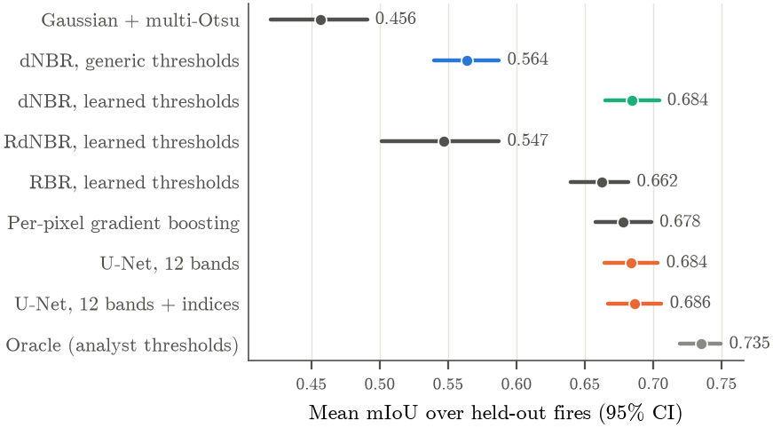
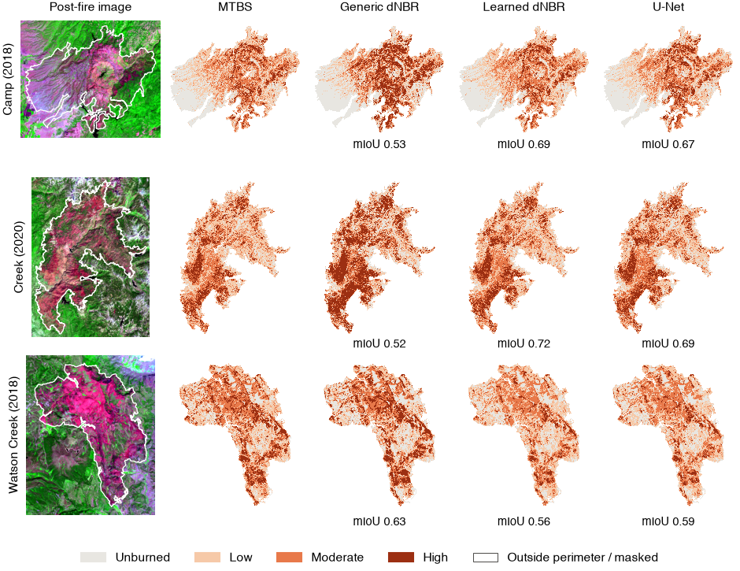

# Per-Fire Threshold Calibration Limits Burn Severity Mapping on Unseen Wildfires

[Paper (PDF)](paper/main.pdf)

Burn severity maps guide post-fire erosion control, debris-flow warnings, and reforestation. In the United States, the Monitoring Trends in Burn Severity (MTBS) program produces these maps by thresholding the differenced Normalized Burn Ratio (dNBR), with thresholds chosen by an analyst for each fire. The evaluation here scores automatic methods on how closely they reproduce MTBS maps on fires excluded from training.

The dataset contains 31 California and Oregon wildfires from 2018 to 2021 (7.1 million acres, 31.4 million labeled pixels) on the exact Landsat scenes MTBS used. Five-fold cross-validation holds out whole fires together with the fires that overlap them. The methods are dNBR with generic thresholds, dNBR, RdNBR, and RBR with thresholds learned on the training fires, a per-pixel gradient-boosting classifier, and two U-Net variants. An oracle that applies each fire's own analyst thresholds gives a reference ceiling.

## Results



| Method | mIoU | Macro-F1 | Pixel accuracy |
|--------|------|----------|----------------|
| Gaussian + multi-Otsu | 0.456 | 0.611 | 0.612 |
| dNBR, generic thresholds (100, 270, 440) | 0.564 | 0.708 | 0.718 |
| dNBR, learned thresholds | 0.684 | 0.808 | 0.820 |
| RdNBR, learned thresholds | 0.547 | 0.693 | 0.700 |
| RBR, learned thresholds | 0.662 | 0.793 | 0.802 |
| Per-pixel gradient boosting | 0.678 | 0.804 | 0.814 |
| U-Net, 12 bands | 0.684 | 0.809 | 0.819 |
| U-Net, 12 bands + indices | 0.686 | 0.810 | 0.822 |
| Oracle, analyst thresholds | 0.735 | 0.845 | 0.854 |

Mean over the 31 held-out fires. Each fire is scored by models trained on the other four folds.

- Learning the thresholds on other fires raises mean mIoU from 0.564 to 0.684 and improves 29 of 31 fires.
- Neither U-Net improves on calibrated dNBR. The paired difference for the better variant is +0.002 (95% CI −0.009 to +0.014).
- The oracle's advantage on a fire grows with the distance between its analyst thresholds and the learned ones (Spearman ρ = 0.68).
- 99.8% of the remaining errors confuse adjacent classes, and 93.2% lie within 30 m of a class transition in the MTBS map.



## Data

- **Fires.** Every MTBS wildfire in California or Oregon from 2018, 2020, and 2021 that burned at least 60,000 acres, was mapped with an extended assessment, and used Landsat 8 or 9 for both scenes. `data/fires.csv` lists them with their scene IDs, analyst thresholds, and folds.
- **Labels.** MTBS thematic burn severity mosaics and fire perimeters from [MTBS](https://www.mtbs.gov/), restricted to each fire's perimeter. The classes are unburned, low, moderate, and high.
- **Inputs.** Landsat Collection 2 Level-2 surface reflectance, bands 2 to 7, for the pre- and post-fire scenes named in each MTBS record, read from [Microsoft Planetary Computer](https://planetarycomputer.microsoft.com/) and warped onto the 30 m MTBS grid.
- **Cross-validation.** Fires that overlap share a group, and groups are assigned to five folds with balanced burned area.

## Repository

| Path | Contents |
|------|----------|
| `robust/fires.py` | Selects fires and assigns folds from the MTBS perimeter database |
| `robust/fetch.py` | Downloads Landsat scenes and MTBS labels for each fire |
| `robust/baselines.py` | Index thresholding, learned thresholds, gradient boosting, and the oracle |
| `robust/unet.py` | U-Net training and sliding-window inference per fold |
| `robust/report.py`, `robust/analysis.py` | Tables, figures, and every number in the paper |
| `robust/run_all.sh` | Runs the full pipeline |
| `paper/` | LaTeX source, generated tables and figures, and the PDF |
| `results/` | Per-fire metrics, learned thresholds, training histories, and logs |
| `src/`, `run_pipeline.py` | Single-fire classical pipeline (Gaussian smoothing and multi-Otsu thresholding) |

## Reproducing the results

The pipeline needs Python 3.12 and about 64 GB of memory. Building the PDF needs [tectonic](https://tectonic-typesetting.github.io). Each U-Net fold trains in about 22 minutes on an Apple M5 Pro.

```bash
python3.12 -m venv .venv && source .venv/bin/activate
pip install -r requirements.txt
```

Download the MTBS perimeter database to `data/mtbs/mtbs_perimeter_data/` and the 2018, 2020, and 2021 CONUS severity mosaics to `data/mtbs/mtbs_CONUS_<year>/`. Then run the steps in order.

```bash
python -m robust.fires
python -m robust.fetch
python -m robust.baselines
python -m robust.unet --variant bands_idx
python -m robust.unet --variant bands
python -m robust.report
python -m robust.analysis
cd paper && tectonic -X compile main.tex
```

`robust/run_all.sh` runs the same steps and skips finished ones. Fold 4 of the 12-band U-Net was retrained with `--folds 4 --clip 1.0` after its loss became undefined, as reported in the paper.
